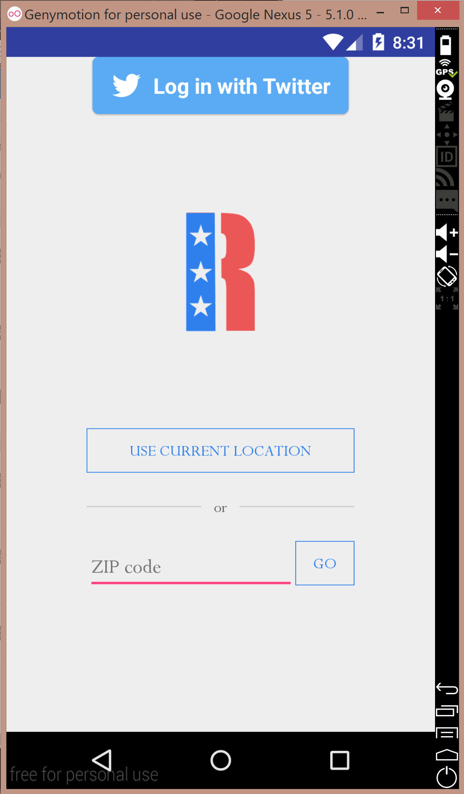
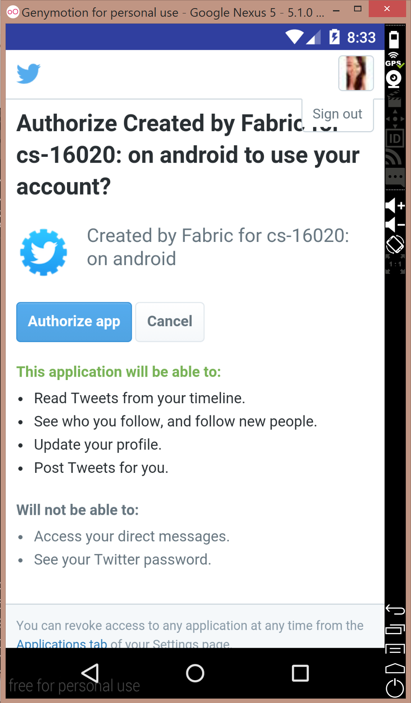
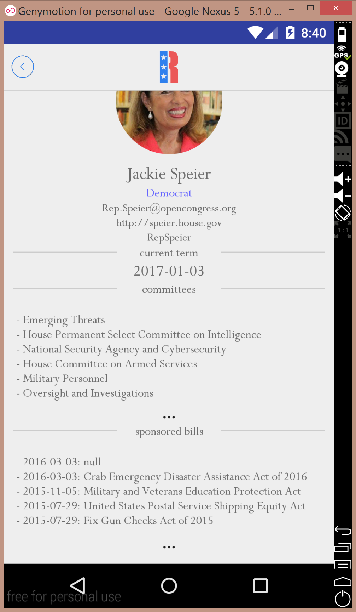
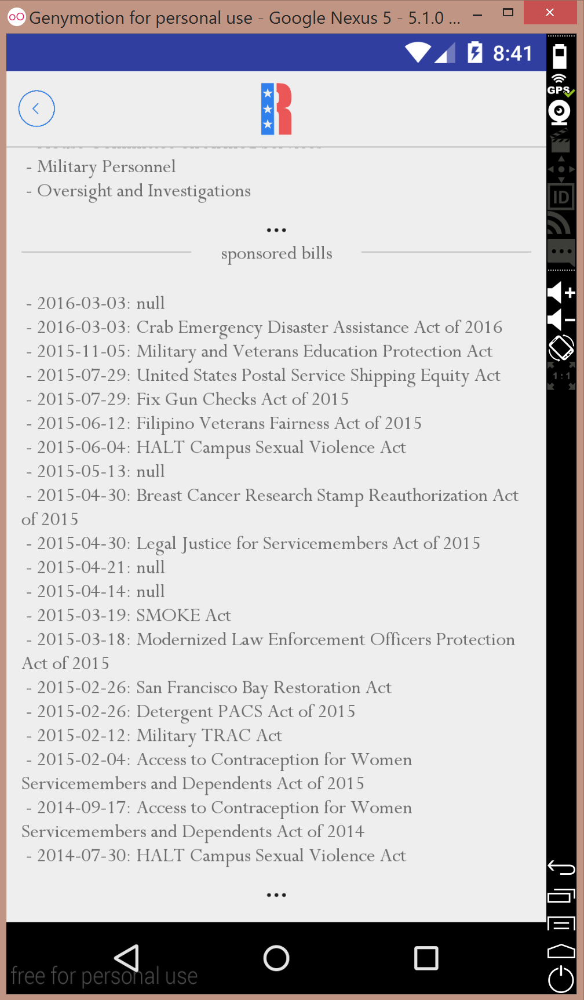
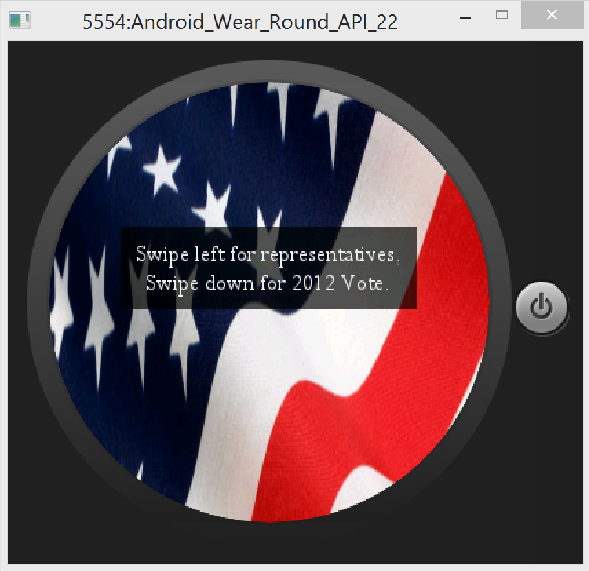
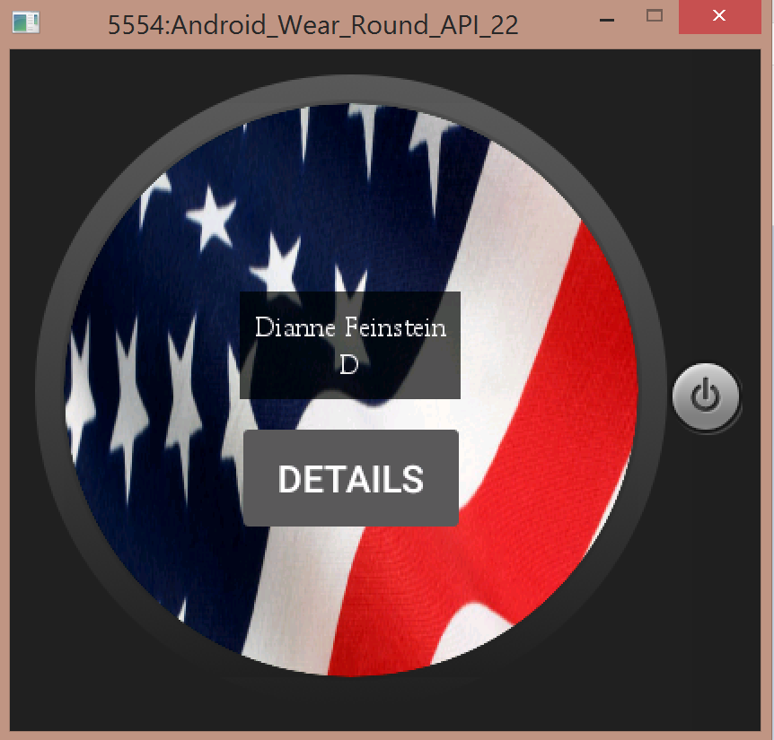
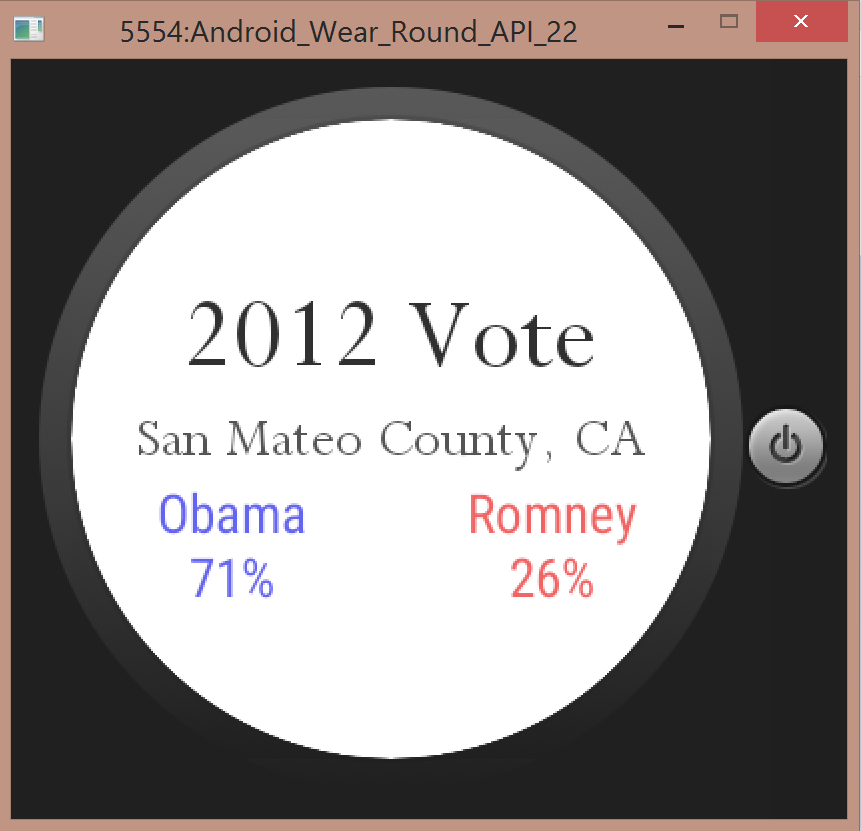

# PROG 02: Represent!

Represent! is a simple, easy to use mobile and watch application that will help you keep up-to-date with your favorite congresspeople and representatives. 

Simply choose to either use your location, which will find you with the phone’s GPS coordinates, or enter the ZIP code that you wish to receive representative information for. The app will display a list of all 3-4 representatives in that area on both your phone and your watch. Scroll through on the phone to see a summary bio of each representative, or swipe through on your watch to get a quick overview on your representatives. 

On either the phone or the watch, you can select more information to view the representative’s name, party, contact information, term end date, committees, and sponsored bills. Go back to the main screen to choose a different location.

On the watch, you may also swipe downwards to view the 2012 presidential election results for your selected county, in percentages. Swipe up to return to the main screen.

## Authors

Judy Wang ([judy.wang@berkeley.edu](mailto:judy.wang@berkeley.edu))

## Demo Video

See [Represent!](https://youtu.be/S6zqw3L_zN0)

## Screenshots

